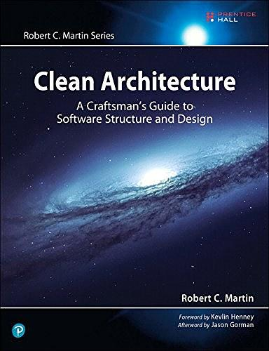

# Clean Architecture in Ruby Gem 实战

author: Teddy <teddy@gfresh.io>

## 什么是简洁架构



## Clean Architectures in Python

https://leanpub.com/clean-architectures-in-python


## 层级和数据的流向


## 由内向外的构建

## 创建一个 Gem

bundle gem gfresh_point

### Domain

```ruby
module GfreshPoint
  module Domain
    class Rule
      attr_accessor :app_id, :event_name, :point

      def initialize(app_id:, event_name:, point:)
        @app_id = app_id
        @event_name = event_name
        @point = point
      end

    end
  end
end
```

### Usecase

```ruby
module GfreshPoint
  module Usecase
    class RuleListUsecase < BaseUsecase
      def execute(request)
        rules = repo.list_rules(request.filters[:app_id])
      end
    end
  end
end
```

### Repo

MemRepo, 用于测试，让 gem 测试不依赖数据库

```ruby
module GfreshPoint
  module Repository
    class MemRepo

      attr_accessor :data

      def initialize(data)
        @data = data
      end

      def list_rules(app_id)
        data.select {|d| d.app_id == app_id}
      end

    end
  end
end
```

## Error Management

书中作为了单独的一章，我觉得挺有必要的。

## Request and Response

每个 usecase 的调用 都需要个 request 并且返回一个 response.

### Request

```ruby
module GfreshPoint
  module RequestObjects
    class RuleListRequest < RequestObject
      attr_accessor :filters

      ACCEPTED_FILTERS = ['app_id']

      def initialize(params = {})
        @filters = params[:filters] || {}
        @filters.keys.each do |filter|
          unless ACCEPTED_FILTERS.include?(filter.to_s)
            add_error('filters', "Key #{filter} can not be used")
          end
        end
      end

    end
  end
end
```

### Request 的验证

```ruby
module GfreshPoint
  module RequestObjects
    class RequestObject
      def add_error(param, message)
        errors << {'param': param, message: message}
      end

      def has_errors
        errors.count > 0
      end

      def success?
        !has_errors
      end

      def errors
        @errors ||= []
      end
    end
  end
end
```

### Response 的成功与失败

成功则把 usecase 的返回值作为 value

```ruby
module GfreshPoint
  module ResponseObjects
    class ResponseSuccess
      attr_accessor :value

      def initialize(value = nil)
        @value = value
      end

      def success?
        true
      end
    end
  end
end
```

### Response 的成功与失败

失败则储存失败的原因

```ruby
module GfreshPoint
  module ResponseObjects
    class ResponseFailure
      RESOURCE_ERROR   = 'ResourceError'
      PARAMETERS_ERROR = 'ParametersError'
      SYSTEM_ERROR     = 'SystemError'

      def initialize(type, message)
        @type = type
        @message = message
      end

      def success?
        false
      end
    end
  end
end
```

## Usecase 的错误管理

之前的实现

```ruby
  def create(params = {})
    @apply = repo.build_apply(params)
    validator.load_attributes_from_instance(@apply)
    validator.action              = :create

    if validator.valid?
      apply_created_event if @apply = repo_create(@apply)
      @apply
    else
      @errors = validator.errors.messages
      false
    end
  end
```

### 使用模板模式消除重复

抽取 request 和 response 可以减少 usecase 自身的责任

```ruby
module GfreshPoint
  module Usecase
    class BaseUsecase
      attr_accessor :repo

      def initialize( repo)
        @repo = repo
      end

      def call(request)
        if request.success?
          result = execute(request)
          generate_response(result)
        else
          ResponseFailure(ResponseFailure::PARAMETERS_ERROR, request.errors)
        end
      rescue StandardError => e
        ResponseFailure(ResponseFailure::SYSTEM_ERROR, e.message)
      end

      def generate_response(result)
        GfreshPoint::ResponseObjects::ResponseSuccess.new(result)
      end

      def execute(request)
        raise "Not impl"
      end

    end
  end
end

```

### 现在的写法

```ruby

module GfreshPoint
  module Usecase
    class RuleListUsecase < BaseUsecase
      def execute(request) # overwrite execute method
        rules = repo.list_rules(request.filters[:app_id])
      end
    end
  end
end

```


## 具体的 ActiveRecordRepo 实现

```ruby
module GfreshPoint
  module Repository
    class ActiveRecordRepo
      def list_rules(app_id)
        Rule.where(app_id: app_id)
      end

      def update_rule_point(app_id, rule_id, point)
        Rule.find(rule_id).update!(point: point)
      end

      def get_user_last_balance(app_id, user_id)
        Balance.where(app_id: app_id).where(user_id: user_id).
          order(created_at: desc).first
      end

      def create_balance(app_id, user_id, point, balance)
        Balance.create!(app_id: app_id, user_id: user_id, point: point, balance: balance)
      end

    end

    class Rule < ActiveRecord::Base
      self.table_name = "gfresh_point_rules"
    end

    class Balance < ActiveRecord::Base
      self.table_name = "gfresh_point_balances"
    end
  end
end

```

### 生成 Migration

`bundle exec rails generate gfresh_point:install`

```ruby
module GfreshPoint
  module Generators
    class InstallGenerator < ::Rails::Generators::Base
      include Rails::Generators::Migration
      source_root File.expand_path('../templates', __FILE__)
      desc "Add the migrations for Gfresh Point Rule"

      def self.next_migration_number(path)
        next_migration_number = current_migration_number(path) + 1
        ActiveRecord::Migration.next_migration_number(next_migration_number)
      end

      def copy_migrations
        migration_template "create_gfresh_point_rule.rb",
          "db/migrate/create_gfresh_point_rule.rb"
      end
    end
  end
end

```


## 嵌入 HTTP Server (Rails)

Rails 项目中引入 gem

gem "gfresh_point", path: "../points"

### 在项目中使用

```ruby
request_object = GfreshPoint::RequestObjects::RuleListRequest.new(filters: {app_id: "beachpricex"})
repo =  GfreshPoint::Repository::ActiveRecordRepo.new

use_case = GfreshPoint::Usecase::RuleListUsecase.new(repo)
response = use_case.call(request_object)
@rules = response.value
```

## 问题

### 如何去除重复

现在每次都要指定 activeRecordRepo, 应该改成可配置的
另外 app_id 也应该是一个全局变量

### 数据库功能的测试

实际功能很依赖数据库的事务，目前的用内存数据库测试的方法没什么意义
