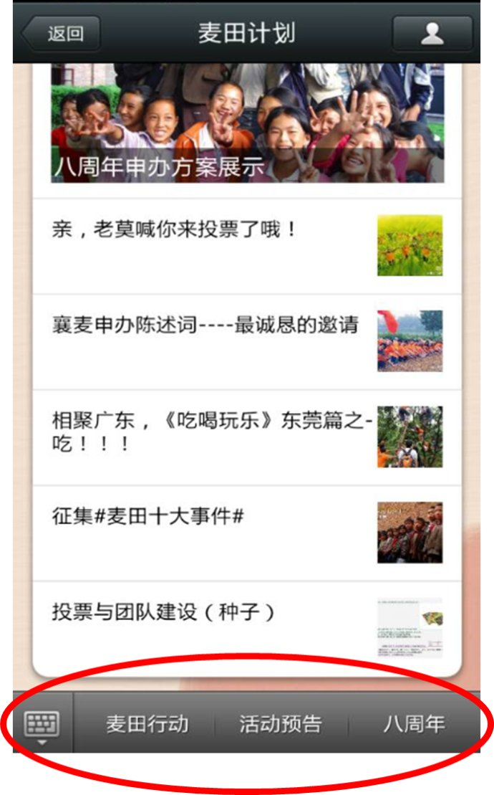
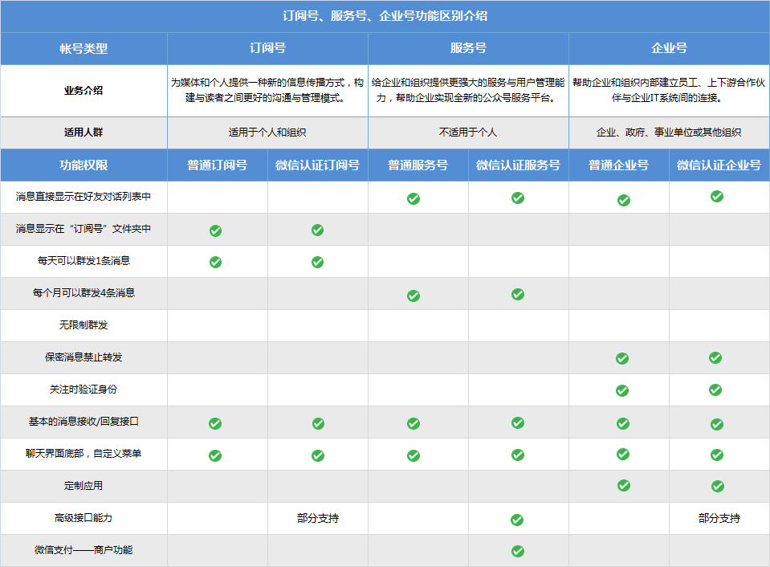
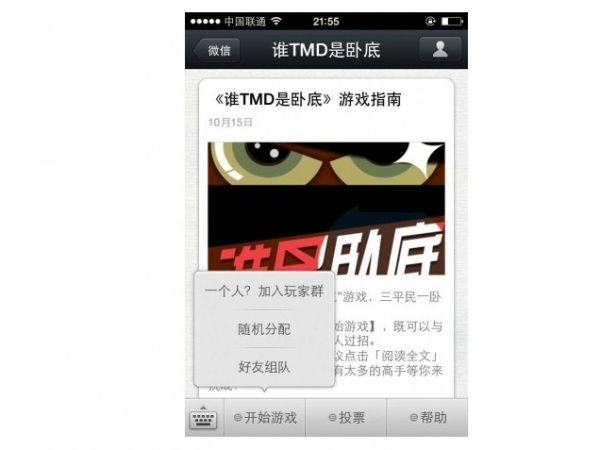
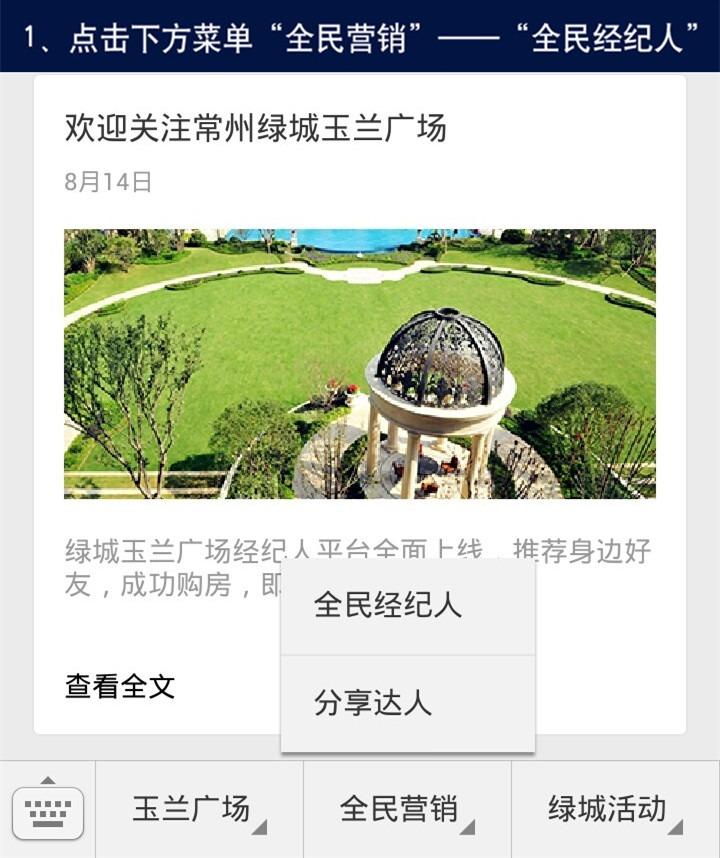
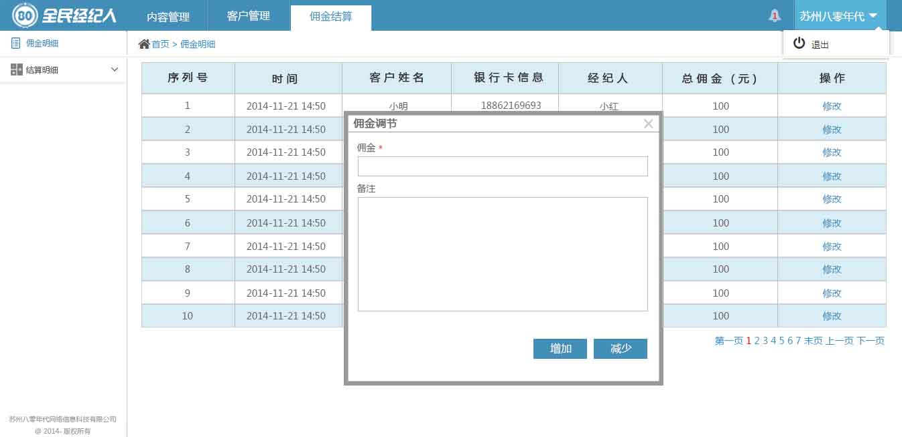
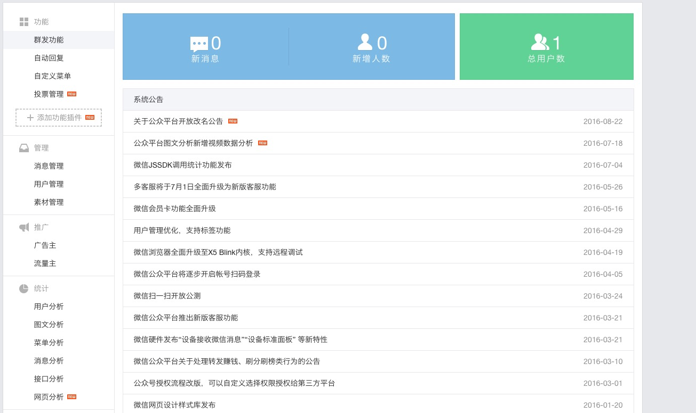
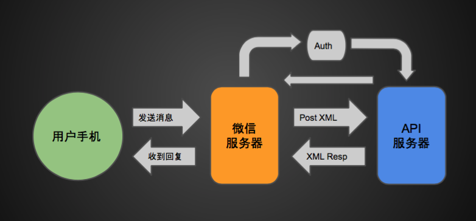

# 微信公众号开发蓝皮书

author: 马陆骋&lt;malucheng@boohee.com&gt;

## 微信公众号是什么?

> 微信公众号是开发者或商家在微信公众平台上申请的应用账号，通过公众号，商家可在微信平台上实现和特定群体的文字、图片、语音、视频的全方位沟通、互动 。形成了一种主流的线上线下微信互动营销方式。

## 信息交互

### 消息类型

- 文本消息
- 图片消息
- 语音消息
- 视频消息
- 小视频消息
- 地理位置消息
- 链接消息

### 自定义菜单类型

- click：点击推事件
- view：跳转URL
- scancode_push：扫码推事件
- scancode_waitmsg：扫码推事件且弹出“消息接收中”提示框
- pic_sysphoto：弹出系统拍照发图
- pic_photo_or_album：弹出拍照或者相册发图
- pic_weixin：弹出微信相册发图器
- location_select：弹出地理位置选择器
- media_id：下发消息（除文本消息）
- view_limited：跳转图文消息URL

## 微信公众号的类型

- 订阅号
- 服务号
- 企业号

### 订阅号

> 为媒体和个人提供一种新的信息传播方式，构建与读者之间更好的沟通与管理模式。

### 服务号

> 给企业和组织提供更强大的业务服务与用户管理能力，帮助企业快速实现全新的公众号服务平台。

### 企业号

> 为企业或组织提供移动应用入口，帮助企业建立与员工、上下游供应链及企业应用间的连接。

### 总结

## 微信能做什么

任何传统 web 上可以做的事情都可以搬到微信上:

- 餐饮行业
- 房产置业
- 婚庆影楼
- 教育培训
- 酒店宾馆
- 景区旅游
- 掌上汽车
- 订单外卖
- 医疗保健

## 微信还能做什么

微信是一个平台, 可以认为它是一个封闭的定制浏览器.

不考虑封闭性带来的坏处, 使用微信平台的优势

- 支付功能
- 地理位置
- 自带账号
- 反向推送
- 硬件连接

## 微信相比 Native APP 的优势

- 用户获取成本低
- 轻量级开发(mobile h5)
- 完整的生态环境(支付, 地理位置, 推送等接口)
- 适用于各个量级的业务

## 经典案例

### 招商银行

### 谁是卧底

### 全民经纪人

### 全民经纪人

## 开发微信公众号应用

### 可选方式

- 微信原生后台
- 第三方平台
- 自己开发

### 微信原生后台

优点: 原生, 零开发

缺点: 功能不够强大

### 第三方平台

优点: 功能相对强大

缺点: 收费, 客制化困难

- [有赞](https://www.youzan.com/)
- [微客来](http://www.vcooline.com/)

### 自己开发

- 服务器(域名和80端口) 服务端语言任选
- 前端和 mobile 端 web 无异, 只需要额外的一些 SDK

## Questions?
