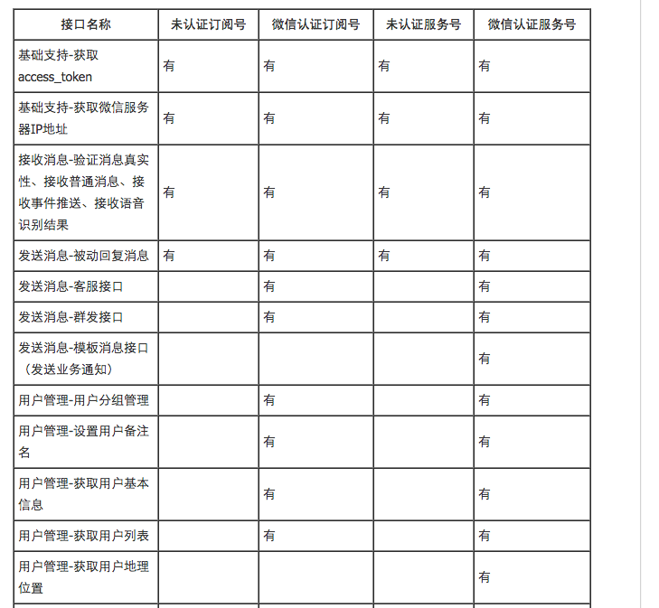

# 微信开发蓝皮书

author: 马陆骋&lt;malucheng@boohee.com&gt;

## 目录

- 微信是什么
- 微信能做什么
- 开发微信需要的准备
- 微信开发的技术要求

## 微信是什么?

> 微信 (WeChat)[1]  是腾讯公司于2011年1月21日推出的一个为智能终端提供即时通讯服务的免费应用程序，[1]  微信支持跨通信运营商、跨操作系统平台通过网络快速发送免费（需消耗少量网络流量）语音短信、视频、图片和文字，同时，也可以使用通过共享流媒体内容的资料和基于位置的社交插件“摇一摇”、“漂流瓶”、“朋友圈”、”公众平台“、”语音记事本“等服务插件。

## 微信能做什么

任何传统 web 上可以做的事情都可以搬到微信上:

- 餐饮行业
- 房产置业
- 婚庆影楼
- 教育培训
- 酒店宾馆
- 景区旅游
- 掌上汽车
- 订单外卖
- 医疗保健

## 微信还能做什么

微信是一个平台, 可以认为它是一个封闭的定制浏览器.

不考虑封闭性带来的坏处, 使用微信平台的优势

- 支付功能
- 地理位置
- 自带账号
- 反向推送
- 硬件连接

## 微信相比 Native APP 的优势

- 用户获取成本低
- 轻量级开发(mobile h5)
- 完整的生态环境(支付, 地理位置, 推送等接口)
- 适用于各个量级的业务

## 经典案例

### 招商银行

### 谁是卧底

### 全民经纪人

### 全民经纪人

## 使用微信平台(开发者模式)所需的准备工作

- 公众号
- 服务器

### 公众号

微信认证分为资质认证和名称认证两部分，只需要资质认证通过，就可获得接口。

https://mp.weixin.qq.com/wiki/13/8d4957b72037e3308a0ca1b21f25ae8d.html

...

### 服务器

服务器与域名(微信只认80端口)

## 开发微信应用需要的技术

- 服务端语言任选
- 前端和 mobile 端 web 无异, 只需要额外的一些 sdk
